# Dependencies

## Summary

- **Production:** 64 packages
- **Development:** 21 packages
- **Total:** 85 packages

## Production Dependencies

| Package | Version |
|---------|----------|
| `symfony/finder` | `^8` |
| `symfony/process` | `^8` |
| `doctrine/dbal` | `^4.3.4` |
| `gettext/php-scanner` | `^2.0.1` |
| `league/csv` | `^9.27.1` |
| `potibm/phluesky` | `^0.6.1` |
| `symfony/redis-messenger` | `^8` |
| `league/flysystem-sftp-v3` | `^3.30` |
| `lstrojny/fxmlrpc` | `dev-master` |
| `monolog/monolog` | `^3.9` |
| `spomky-labs/otphp` | `^11.3` |
| `symfony/monolog-bridge` | `^8` |
| `dragonmantank/cron-expression` | `^3.4` |
| `guzzlehttp/guzzle` | `^7.10` |
| `lbuchs/webauthn` | `^2.2` |
| `myclabs/deep-copy` | `^1.13.4` |
| `pagerfanta/doctrine-orm-adapter` | `^4.7.2` |
| `skoerfgen/acmecert` | `^3.7.1` |
| `vlucas/phpdotenv` | `^5.6.2` |
| `wikimedia/composer-merge-plugin` | `dev-master` |
| `azuracast/nowplaying` | `dev-main` |
| `brick/math` | `^0.14` |
| `gettext/gettext` | `^5.7.3` |
| `league/flysystem-aws-s3-v3` | `^3.30.1` |
| `league/oauth2-client` | `^2.8.1` |
| `supervisorphp/supervisor` | `dev-main` |
| `symfony/property-access` | `^8` |
| `doctrine/data-fixtures` | `^2.2` |
| `doctrine/orm` | `^3.5.3` |
| `promphp/prometheus_client_php` | `^2.14.1` |
| `symfony/cache` | `^8` |
| `gettext/translator` | `^1.2.1` |
| `james-heinrich/getid3` | `v2.0.0-beta6` |
| `symfony/console` | `^8` |
| `symfony/uid` | `^8` |
| `beberlei/doctrineextensions` | `^1.5` |
| `doctrine/migrations` | `^3.9.4` |
| `pagerfanta/doctrine-collections-adapter` | `^4.7.2` |
| `spatie/flysystem-dropbox` | `^3.0.2` |
| `br33f/php-ga4-mp` | `^0.1.5` |
| `league/mime-type-detection` | `^1.16` |
| `rlanvin/php-ip` | `dev-master` |
| `symfony/event-dispatcher` | `^8` |
| `symfony/filesystem` | `^8` |
| `intervention/image` | `^3.11.4` |
| `matomo/device-detector` | `^6.4.7` |
| `symfony/mailer` | `^8` |
| `nesbot/carbon` | `^3.10.3` |
| `symfony/serializer` | `^8` |
| `symfony/validator` | `^8` |

*... and 14 more*

## Development Dependencies

| Package | Version |
|---------|----------|
| `codeception/module-cli` | `^2.0.1` |
| `codeception/module-rest` | `^3.4.1` |
| `nette/php-generator` | `^4.2` |
| `codeception/module-asserts` | `^3.2` |
| `codeception/module-doctrine` | `^3.2` |
| `codeception/module-phpbrowser` | `dev-master` |
| `mockery/mockery` | `^1.6.12` |
| `php-parallel-lint/php-console-highlighter` | `^1` |
| `php-parallel-lint/php-parallel-lint` | `^1.4` |
| `phpstan/phpstan` | `^2.1.31` |
| `phpunit/phpunit` | `^12.4.1` |
| `codeception/codeception` | `^5.3.2` |
| `filp/whoops` | `^2.18.4` |
| `maxmind-db/reader` | `^1.12.1` |
| `psy/psysh` | `^0.12.14` |
| `roave/security-advisories` | `dev-latest` |
| `slevomat/coding-standard` | `^8.24` |
| `symfony/var-dumper` | `^8` |
| `phpstan/phpstan-doctrine` | `^2.0.10` |
| `pyrech/composer-changelogs` | `^2.1` |
| `squizlabs/php_codesniffer` | `^4` |

## Dependency Graph

```mermaid
graph TD
  Root[Your Application]
  Root --> aws_aws_crt_php["aws/aws-crt-php<br/>v1.2.7"]
  Root --> aws_aws_sdk_php["aws/aws-sdk-php<br/>3.369.20"]
  aws_aws_sdk_php --> symfony_filesystem["symfony/filesystem<br/>^v5.4.45 || ^v6.4.3 || ^v7.1.0 || ^v8.0.0"]
  aws_aws_sdk_php --> guzzlehttp_guzzle["guzzlehttp/guzzle<br/>^7.4.5"]
  aws_aws_sdk_php --> guzzlehttp_psr7["guzzlehttp/psr7<br/>^2.4.5"]
  Root --> azuracast_doctrine_entity_normalizer["azuracast/doctrine-entity-normalizer<br/>3.3.0"]
  azuracast_doctrine_entity_normalizer --> symfony_property_info["symfony/property-info<br/>^7"]
  azuracast_doctrine_entity_normalizer --> symfony_serializer["symfony/serializer<br/>^8"]
  azuracast_doctrine_entity_normalizer --> doctrine_collections["doctrine/collections<br/>>1"]
  Root --> azuracast_nowplaying["azuracast/nowplaying<br/>dev-main"]
  azuracast_nowplaying --> guzzlehttp_guzzle["guzzlehttp/guzzle<br/>>7"]
  azuracast_nowplaying --> psr_log["psr/log<br/>>=1"]
  azuracast_nowplaying --> psr_http_client["psr/http-client<br/>*"]
  Root --> beberlei_doctrineextensions["beberlei/doctrineextensions<br/>v1.5.0"]
  beberlei_doctrineextensions --> doctrine_orm["doctrine/orm<br/>^2.19 || ^3.0"]
  Root --> br33f_php_ga4_mp["br33f/php-ga4-mp<br/>v0.1.6"]
  br33f_php_ga4_mp --> guzzlehttp_guzzle["guzzlehttp/guzzle<br/>^6.5.5 || ^7.0.0"]
  Root --> brick_math["brick/math<br/>0.14.1"]
  Root --> carbonphp_carbon_doctrine_types["carbonphp/carbon-doctrine-types<br/>3.2.0"]
  Root --> composer_ca_bundle["composer/ca-bundle<br/>1.5.10"]
  Root --> dflydev_fig_cookies["dflydev/fig-cookies<br/>v3.2.0"]
  dflydev_fig_cookies --> psr_http_message["psr/http-message<br/>^1.0.1 || ^2"]
  Root --> doctrine_collections["doctrine/collections<br/>2.6.0"]
  doctrine_collections --> doctrine_deprecations["doctrine/deprecations<br/>^1"]
  doctrine_collections --> symfony_polyfill_php84["symfony/polyfill-php84<br/>^1.30"]
  Root --> doctrine_data_fixtures["doctrine/data-fixtures<br/>2.2.0"]
  doctrine_data_fixtures --> doctrine_persistence["doctrine/persistence<br/>^3.1 || ^4.0"]
  doctrine_data_fixtures --> psr_log["psr/log<br/>^1.1 || ^2 || ^3"]
  Root --> doctrine_dbal["doctrine/dbal<br/>4.4.1"]
  doctrine_dbal --> doctrine_deprecations["doctrine/deprecations<br/>^1.1.5"]
  doctrine_dbal --> psr_cache["psr/cache<br/>^1|^2|^3"]
  doctrine_dbal --> psr_log["psr/log<br/>^1|^2|^3"]
  Root --> doctrine_deprecations["doctrine/deprecations<br/>1.1.5"]
  Root --> doctrine_event_manager["doctrine/event-manager<br/>2.1.0"]

```

*For detailed dependency information, use the `analyze_dependencies` tool.*
